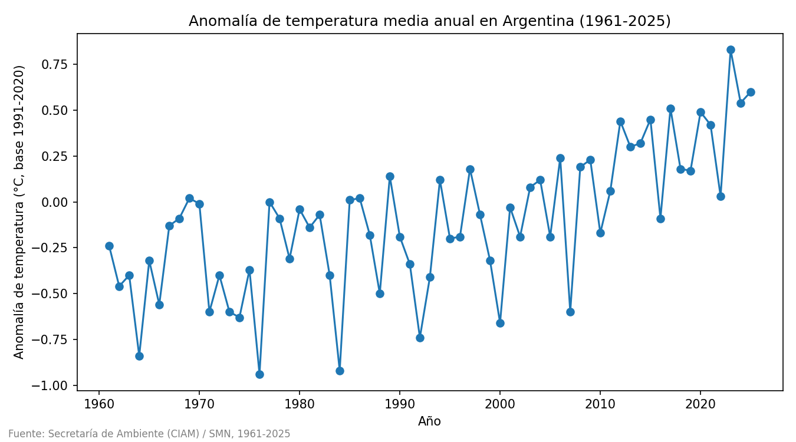
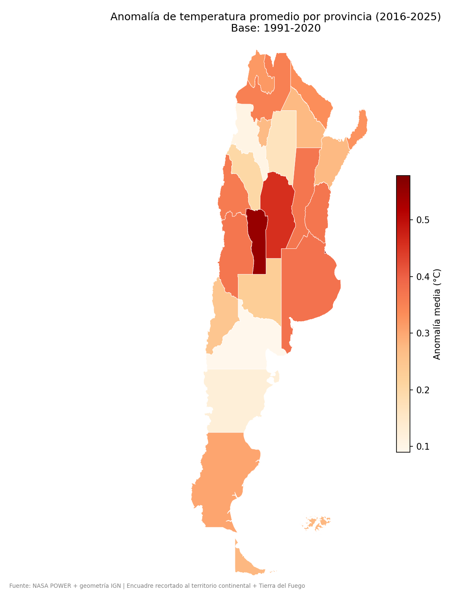
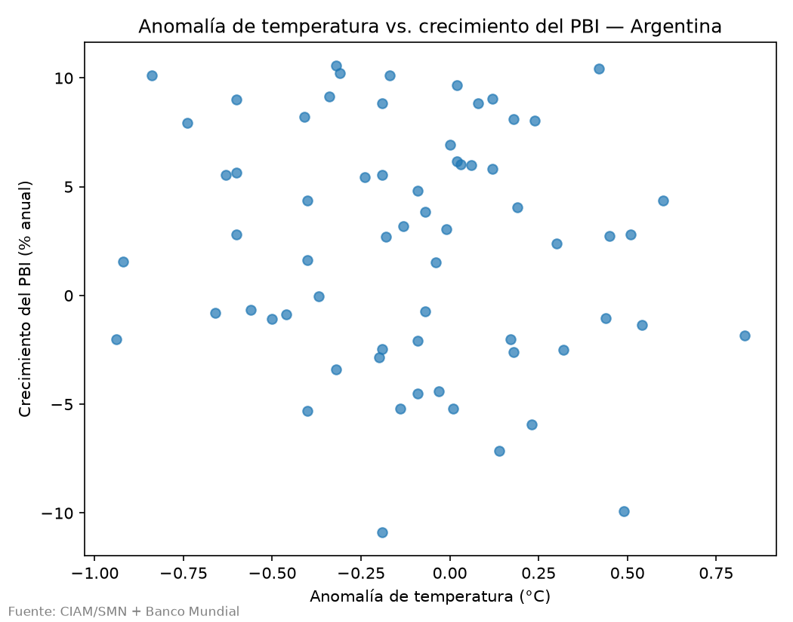
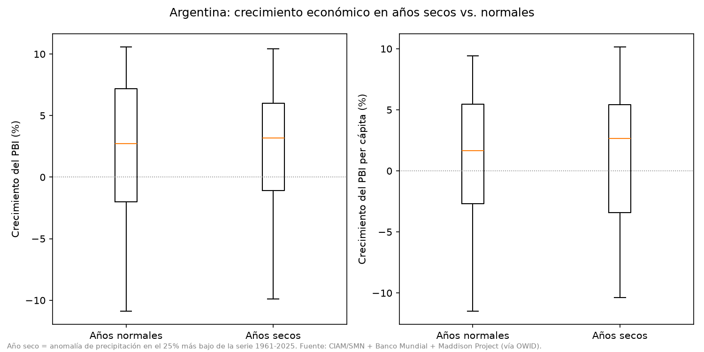
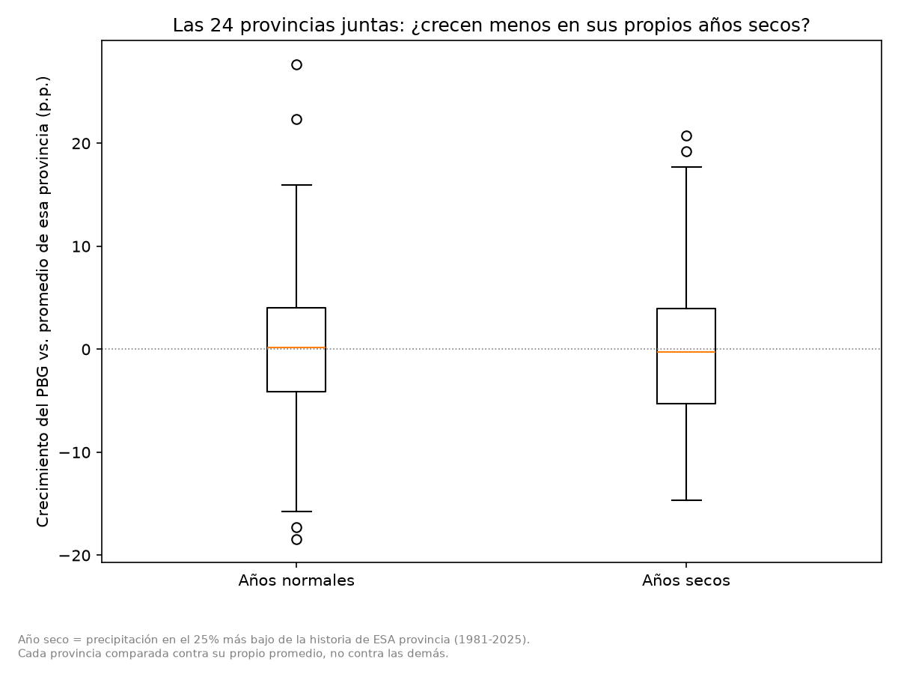

# La pregunta y la respuesta

**Pregunta central del proyecto:** ¿el cambio climático afecta a la economía argentina?

Este documento explica tres cosas: **qué datos se tienen**, **qué se demuestra** y **cómo se demuestra**. Cada número sale de una tabla del proyecto (`argentina-clima-pbi/outputs/tables/`) y puede verse de forma interactiva en la página **Respuesta a la pregunta** de la aplicación (ver [COMO_LEVANTAR_EL_PROYECTO.md](COMO_LEVANTAR_EL_PROYECTO.md)). Los términos técnicos se mantienen y llevan su significado entre paréntesis en el mismo texto; el glosario completo está en la página Conclusiones de la aplicación.

---

## La respuesta en un minuto

**El clima de Argentina cambió con seguridad y el calor reduce el rendimiento de los cultivos (maíz -11 %, trigo -13 %, soja -9 % por cada °C); ese golpe se diluye y no es detectable en el PBI total ni en el PBI per cápita del país.**

En cada resultado, lo que está entre paréntesis explica lo que está antes.

**1. ¿Argentina se está calentando?** — *Demostrado*

Sí, sube un +0,13 °C por década ≈ 0,86 °C en 64 años, p < 0,001 (la temperatura promedio del país sube unos 0,13 grados cada 10 años y en 64 años eso suma casi 1 grado; el signo ≈ quiere decir "aproximadamente"; y la p es la probabilidad de que la suba sea pura casualidad: acá es menor a 1 chance en 1.000, o sea que casi seguro es real).

**2. ¿El calor reduce el rendimiento de los cultivos?** — *Demostrado*

Sí: maíz -11,3 %, soja -8,8 % y trigo -13,2 % de rendimiento por cada °C más de calor en la temporada, p < 0,001 en los tres (por cada grado más de calor durante la temporada de cultivo, las toneladas que rinde cada hectárea caen alrededor de esos porcentajes; la p es la probabilidad de que el resultado sea casualidad, y acá es menor a 1 chance en 1.000. El efecto aparece en casi todas las provincias productoras y se sostiene al sacar provincias, mezclar los datos al azar y descontar la tendencia. El girasol no muestra efecto, y en la soja una de las pruebas de control no se cumple, por lo que su resultado es algo menos firme).

**3. ¿El calor frena la producción del campo?** — *Señal moderada*

Sí, el campo crece menos: −5,6 puntos de crecimiento por cada °C más, p = 0,026 (en los años más calurosos de una provincia, su producción agropecuaria creció unos 5,6 puntos porcentuales menos por cada grado de más: si iba a crecer 4 %, cae 1,6 %; hay 2,6 chances en 100 de que sea casualidad, lo que es una pista con bastante respaldo pero no una prueba).

**4. ¿Los años secos frenan al campo?** — *Señal débil*

Posiblemente, pero no está confirmado: −3,0 puntos, p = 0,12 (en los años de poca lluvia el campo creció unos 3 puntos menos, pero hay 12 chances en 100 de que sea casualidad: no alcanza para asegurarlo).

**5. ¿Se nota en la economía total de las provincias?** — *No detectado*

No se detecta: calor −1,0 puntos por °C, p = 0,17; año seco: −0,2 puntos, p = 0,77 (en promedio no se ve efecto sobre toda la economía de la provincia: hay 17 y 77 chances en 100 de casualidad; el campo es solo una parte chica de esa economía y el resto tapa el golpe. Pero donde el campo pesa más, el calor sí pega más: ver paso 6).

**6. ¿Se nota en el PBI per cápita del país?** — *No detectado*

No, no se ve relación: correlación −0,12, p = 0,35 (la correlación es un número de −1 a +1 que dice si dos cosas se mueven juntas; cerca de 0 es casi nada. Acá casi no hay relación entre la temperatura y el crecimiento por habitante, y hay 35 chances en 100 de que lo poco que se ve sea casualidad).

**7. ¿La señal del campo aguanta pruebas duras?** — *Señal moderada*

En buena parte sí: pasa 8 de 12 pruebas; con la corrección de Holm, p = 0,16 (se le hicieron 12 ataques a la señal y resistió 8: por ejemplo, no aparece en sectores que no dependen del clima y el daño crece donde el campo pesa más. Pero la corrección de Holm, que endurece el criterio porque se probaron 6 combinaciones y alguna sale bien por suerte, la deja en 16 chances en 100 de casualidad: es una pista fuerte, no una prueba).

Niveles de evidencia: **Demostrado** es comprobado con solidez; **Señal** significa que los datos apuntan en una dirección pero con incertidumbre; **No detectado** significa que con estos datos no se distingue de la casualidad, lo que no implica que el efecto no exista (puede estar escondido en el promedio o faltar datos).

Un efecto chico en el promedio del país puede ser muy grande para las familias y comunidades que viven de una cosecha. Que no se vea en el PBI total no alcanza para descartar el problema: hay que mirar el sector y la región.

---

## Los datos que se tienen

Todos se descargaron de fuentes oficiales; nada se inventó ni se rellenó. Detalle de cada fuente en `argentina-clima-pbi/data/sources.csv`.

| Dato | Fuente | Período | Filas |
|---|---|---|---|
| Temperatura y lluvia del país | CIAM / SMN | 1961-2025 | 65 años |
| Temperatura y lluvia de cada provincia | NASA POWER | 1981-2025 | 1.080 (provincia-año) |
| Crecimiento del PBI | Banco Mundial | 1960-2025 | 66 años |
| Población y PBI (para el PBI per cápita) | Maddison Project vía OWID | 1850-2024 | 175 años |
| Producción por sector y provincia (PBG) | CEPAL | 2004-2024 | 1.350 filas |
| Rendimiento por cultivo, provincia y departamento | Ministerio de Economía (Agricultura) | 1969-2025 | 160.499 filas |
| Emisiones de gases de efecto invernadero | Secretaría de Ambiente | 1990-2022 | 7.780 filas |
| Rendimiento por cultivo, provincia y departamento (descargado, aún sin analizar) | Ministerio de Economía (Agricultura) | 1969-2025 | 160.499 filas |
| Población por provincia (descargado, aún sin analizar) | INDEC | 2010-2040 | 744 (provincia-año) |
| Límites de provincias (mapas) | IGN | — | 24 polígonos |

Cantidad exacta de filas de cada tabla: `argentina-clima-pbi/outputs/tables/conteo_datasets.csv`. La dirección exacta de cada fuente y una huella para comprobar que los archivos no fueron alterados están en [VERIFICACION_DE_DATASETS.md](VERIFICACION_DE_DATASETS.md).

---

## Cómo se responde: 6 pasos

### Paso 1 — ¿El clima realmente cambió?

- **Qué se tiene:** temperatura de Argentina año por año (1961-2025) y de las 24 jurisdicciones (1981-2025).
- **Qué se demuestra:** Argentina se calienta unos +0,13 °C por década (unos 0,86 °C acumulados en 64 años: casi un grado más que en 1961). Todas las provincias se calientan, unas más que otras; CABA y Misiones lideran.
- **Cómo se demuestra:** se traza la línea de tendencia (hacia dónde van los datos con los años, sin mirar las subas y bajas de cada año) de la temperatura y se calcula el p-valor (la probabilidad de que esa pendiente sea pura casualidad; cuanto más chico, más seguro). Salió menor a 0,001, es decir menos de 1 chance en 1.000: casi seguro es real.





*Conclusión del paso 1:* el cambio climático en Argentina es un hecho medido y estadísticamente sólido (es decir, que no se explica por casualidad).

### Paso 2 — ¿Se nota en la economía del país?

- **Qué se tiene:** PBI per cápita de Argentina 1961-2022 (62 años; el PBI dividido por la cantidad de habitantes) junto con temperatura, lluvia y CO₂ de cada año.
- **Qué se demuestra:** a nivel país no se detecta relación entre el clima y el PBI per cápita.
- **Cómo se demuestra:**
  1. Correlación año por año (un número de −1 a +1 que dice si dos cosas se mueven juntas; cerca de 0 es casi nada): la anomalía de temperatura (cuánto más cálido fue un año respecto de lo normal, promedio 1991-2020) contra el crecimiento por habitante dio −0,12 con p = 0,35 (35 chances en 100 de que lo poco que se ve sea casualidad). Hay años calurosos que crecieron mucho y años frescos que crecieron poco.
  2. Años secos contra años normales (un año seco es uno del 25 % en que menos llovió, comparado con la historia; no es una sequía oficial), con prueba t (compara dos promedios y dice si la diferencia puede ser casualidad): el PBI per cápita creció 1,31 % en años secos y 1,37 % en normales, con p = 0,97 (97 chances en 100 de que la diferencia sea casualidad): prácticamente igual.





*Conclusión del paso 2:* a nivel país, con estos datos, no se detecta relación entre el clima y el PBI per cápita. Eso no significa que no exista: puede quedar escondida en el promedio, porque un país tiene muchos sectores y regiones. El paso siguiente mira dónde debería notarse primero.

### Paso 3 — ¿Se nota en el campo?

- **Qué se tiene:** producción por sector de las 24 provincias entre 2005 y 2023 (CEPAL), cruzada con temperatura y lluvia provinciales: 456 observaciones (24 provincias × 19 años).
- **Qué se demuestra:**
  - El calor parece frenar al campo: por cada 1 °C más, el campo crece unos 5,6 puntos porcentuales menos (los puntos son la diferencia entre dos porcentajes de crecimiento: si el campo iba a crecer 4 % y crece 1 %, perdió 3 puntos; en este caso, en vez de crecer 4 % cae 1,6 %). El intervalo de confianza del 95 % (el rango donde probablemente está el efecto real) va de −10,6 a −0,7 puntos, con p = 0,026 (2,6 chances en 100 de casualidad). Señal moderada.
  - Los años secos apuntan en el mismo sentido (unos 3 puntos menos de crecimiento), pero con p = 0,12 (12 chances en 100 de casualidad) no alcanza para asegurarlo. Señal débil.
  - En la economía total de la provincia el efecto es mucho menor y no se distingue de cero (p = 0,17 y 0,77). El campo es entre el 4 % y el 11 % de la economía en las 8 provincias más agropecuarias, y el resto de los sectores amortigua el golpe.
- **Cómo se demuestra:** regresión con efectos fijos (un cálculo que compara cada provincia contra sí misma, por ejemplo un año caluroso de Córdoba contra uno normal de Córdoba, y descuenta lo que le pasó a todo el país ese año: crisis, pandemia), de modo que quede solo el efecto del clima.
- **Cautela:** se probaron 6 combinaciones (2 resultados × 3 factores); si se prueban muchas cosas, alguna puede salir "bien" por pura suerte (como acertar un número tirando muchas veces). Por eso se lo llama señal y no prueba.

Tabla completa: `argentina-clima-pbi/outputs/tables/impacto_agro_resultados.csv`.

### Paso 4 — ¿El calor reduce el rendimiento de los cultivos?

- **Qué se tiene:** rendimiento (kilos por hectárea) de soja, maíz, trigo y girasol por provincia y campaña, 1981-2023 (Ministerio de Economía; 1,987 observaciones), cruzado con la temperatura y la lluvia de la temporada de cultivo de cada provincia (NASA POWER). El rendimiento es la medida más directa del efecto del clima: no depende de los precios ni de cuánta superficie se decidió sembrar.
- **Qué se demuestra:** el calor de la temporada reduce el rendimiento: maíz -11,3 % por cada °C (rango probable entre -16,0 y -6,6 %, p < 0,001), soja -8,8 % (p = 0,0002) y trigo -13,2 % (p = 0,0006). El girasol no muestra efecto detectable (-1,3 %, p = 0,59). El signo es negativo en 15 de 15 provincias de maíz, 14 de 15 de soja y 11 de 12 de trigo.
- **Cómo se demuestra:** regresión con efectos fijos (compara cada provincia contra sí misma y descuenta lo que le pasó a todo el país en cada campaña, incluido el avance tecnológico) sobre el logaritmo del rendimiento, por lo que el resultado se lee en porcentaje; el clima es el de la temporada de cultivo (soja y maíz de octubre-noviembre a marzo; trigo de julio a noviembre), no el del año calendario.
- **Nivel país:** con la serie nacional (42 campañas, con tendencia lineal) el trigo (-7,3 %, p = 0,023) y el girasol (-10,1 %, p = 0,003) son significativos; la soja (-7,1 %, p = 0,069) y el maíz (-8,5 %, p = 0,085) quedan al borde, con el mismo signo. En orden de magnitud, sobre la producción reciente, un grado más equivale a unos 4,6 millones de toneladas de maíz y 3,1 de soja (estimación con incertidumbre, no una predicción).

| Prueba de control | Maíz | Soja | Trigo | Girasol |
|---|---|---|---|---|
| Efecto (% por °C) | -11,3 | -8,8 | -13,2 | -1,3 |
| p del modelo | < 0,001 | 0,0002 | 0,0006 | 0,59 |
| Mezclando los datos al azar 1.000 veces (permutación; p mínimo posible 0,001) | 0,001 | 0,001 | 0,001 | 0,41 |
| Sacando de a una provincia (en cuántas sigue significativo) | 15 de 15 | 15 de 15 | 12 de 12 | 0 de 8 |
| Con tendencia propia de cada provincia (p) | < 0,001 | < 0,001 | < 0,001 | 0,50 |
| Placebo con el clima de la campaña siguiente (p; debe ser mayor a 0,05) | 0,24 (pasa) | 0,0047 (no pasa) | 0,14 (pasa) | 0,75 (pasa) |

*Conclusión del paso 4:* el calor de la temporada reduce el rendimiento de maíz y trigo con solidez, y el de la soja con una salvedad: el placebo no se cumple, así que parte de su efecto podría deberse a otra cosa. Es una asociación estadística sólida, no una prueba de causalidad. Las temporadas se calentaron unos 0,08 °C por década, por lo que el efecto acumulado ya medido ronda 0,6 % por década; el riesgo grande está en los años calurosos, donde cada grado de más se lleva cerca de una décima parte de la cosecha.

---

### Paso 5 — ¿Dónde pega más?

- **Qué se tiene:** para cada provincia, el crecimiento del campo y de la economía total en años secos y normales, y cuánto pesa el campo en su economía.
- **Qué se demuestra:** en 18 de las 24 provincias el campo creció menos en los años secos que en los normales. Los golpes más fuertes fueron en San Luis (−26,6 puntos), San Juan (−23,5) y Córdoba (−23,0). Mirando la economía total, las que más lo sienten son Córdoba, Entre Ríos y Santa Fe; en cambio Santiago del Estero y La Pampa crecieron igual o más. El orden no sigue del todo al peso del campo (San Luis y San Juan pesan poco), por eso el resultado por provincia es orientativo.
- **Cómo se demuestra:** se compara, provincia por provincia, el crecimiento en años secos contra años normales. Cada provincia tuvo solo entre 2 y 8 años secos, muy pocos para estar seguros.



Tabla: `argentina-clima-pbi/outputs/tables/impacto_agro_por_provincia.csv`.

### Paso 6 — ¿La señal del campo aguanta pruebas duras?

Una señal solo vale si sobrevive a intentos serios de romperla. Se la atacó de varias maneras (`argentina-clima-pbi/src/analisis_robustez.py`; resultados en `outputs/tables/robustez_resultados.csv`).

- **Qué se tiene:** el mismo panel del paso 3 (456 datos) y la producción de todos los sectores de cada provincia, incluidos los que no dependen del clima.
- **Qué se demuestra:** la señal del calor sobre el campo pasa 8 de 12 pruebas y tiene la marca típica de un efecto real (crece con el peso del campo y no aparece en sectores sin relación). Pero al corregir por comparaciones múltiples deja de ser estadísticamente sólida.
- **Cómo se demuestra:** se repite el cálculo cambiando algo cada vez.

| Prueba | Qué se hizo y qué significa | Resultado | Pasa |
|---|---|---|---|
| Sacar una provincia | Repetir el cálculo 24 veces sin una provincia, para ver si la señal depende de una sola. | Se mantiene en 22 de 24 casos; el peor (sin Santiago del Estero) queda justo: p = 0,057 (5,7 chances en 100 de casualidad). | Justo |
| Sin valores extremos | Recortar los años excepcionalmente altos o bajos (winsorizar al 5 % y 95 %). | −4,0 puntos por °C, p = 0,045 (4,5 chances en 100 de casualidad). | Pasa |
| Prueba de permutación | Mezclar al azar las temperaturas 2.000 veces y contar cuántas veces el azar iguala el efecto real. | El azar lo igualó 6 veces: p = 0,0035 (0,35 chances en 100). | Pasa |
| Prueba placebo: construcción, comercio, transporte, finanzas | Repetir el cálculo en sectores que no dependen del clima; si dieran efecto, el resultado sería sospechoso. | Ninguno muestra efecto (p entre 0,11 y 0,69). | Pasa |
| Industria de alimentos y bebidas | Procesa lo que produce el campo, así que el calor debería notarse. | −1,1 puntos por °C, p = 0,031 (3,1 chances en 100 de casualidad). | Pasa |
| Dosis-respuesta | Si el clima realmente causa el daño, debería pegar más donde el sector expuesto pesa más: se mira si el calor frena más a la economía total donde el campo pesa más. | Cada punto más de peso del campo agrega −0,43 puntos por °C, p < 0,001 (menos de 1 chance en 1.000 de casualidad). | Pasa |
| Correlación de Spearman entre provincias | Compara solo el orden (ranking): ¿las provincias donde el campo pesa más son las más golpeadas por los años secos? | −0,35, p = 0,093 (9 chances en 100 de casualidad). | Justo |
| Año muy cálido | Solo el 25 % de los años más cálidos de cada provincia. | −3,0 puntos, p = 0,064 (6,4 chances en 100 de casualidad). | Justo |
| Efecto rezagado | Ver si el calor de un año arrastra efecto al año siguiente. | No: p = 0,79. Es un efecto del mismo año. | Informativo |
| Corrección de Holm | Endurecer el criterio porque se probaron 6 combinaciones a la vez y alguna puede salir bien por suerte. | Calor → campo pasa a p = 0,16 (16 chances en 100 de casualidad). | No pasa |

*Conclusión del paso 6:* la señal del calor sobre el campo es creíble pero no está probada. Sobrevive a casi todos los ataques y la prueba más fuerte (dosis-respuesta) sugiere que el daño existe y se concentra donde el campo pesa. Pero con solo 19 años y 24 provincias, al exigirle el criterio más duro no alcanza. Para pasar de "señal" a "demostrado" hacen falta más años y datos por cultivo (ver [PENDIENTES_PARA_DEMOSTRAR_MAS.md](PENDIENTES_PARA_DEMOSTRAR_MAS.md)).

---

## Qué no se puede afirmar (límites)

- Solo hay 19 años de datos económicos provinciales por sector (2005-2023): poco tiempo para eventos extremos.
- La lluvia y la temperatura provinciales son estimaciones satelitales (NASA POWER), no mediciones de una estación en cada provincia.
- "Año seco" es una definición estadística de este proyecto (el 25 % con menos lluvia de la propia historia), no una emergencia oficial.
- El PBI per cápita provincial no se pudo calcular: no hay población por provincia en las fuentes usadas.
- Con las 6 pruebas originales, el calor sobre el campo no sobrevive a la corrección de Holm (p = 0,16).
- Ningún resultado implica causalidad (que una cosa provoque la otra): que dos cosas se muevan juntas no lo prueba.

## Qué haría falta para demostrar más

Detalle completo (preguntas originales sin responder, objeciones posibles y cómo reforzar la respuesta, fuentes candidatas) en [PENDIENTES_PARA_DEMOSTRAR_MAS.md](PENDIENTES_PARA_DEMOSTRAR_MAS.md). Lo principal:

1. Series por cultivo (soja, maíz, trigo) y más largas.
2. Población por provincia (INDEC) para el PBI per cápita provincial.
3. Registro de eventos extremos (emergencias agropecuarias) en lugar de solo la lluvia anual.
4. Empleo y exportaciones agropecuarias.

Aunque se consigan, el resultado puede seguir siendo débil: esa también sería una respuesta válida y se informaría igual.

---

## Cómo reproducirlo

Los resultados salen de estos comandos (ver [argentina-clima-pbi/COMO_EJECUTAR.md](argentina-clima-pbi/COMO_EJECUTAR.md)):

```
python -m src.analisis_nacional               # paso 1
python -m src.analisis_sequia_economia        # paso 2 (años secos)
python -m src.analisis_impacto_agropecuario   # pasos 2, 3 y 4
python -m src.analisis_rendimiento_cultivos   # paso 4 (rendimiento por cultivo)
python -m src.analisis_robustez               # paso 6 (pruebas duras)
```

Otros documentos: hallazgos completos en [argentina-clima-pbi/CONCLUSIONES.md](argentina-clima-pbi/CONCLUSIONES.md); cómo se construyó cada parte en [argentina-clima-pbi/RESUMEN_FUNCIONAMIENTO.md](argentina-clima-pbi/RESUMEN_FUNCIONAMIENTO.md).
